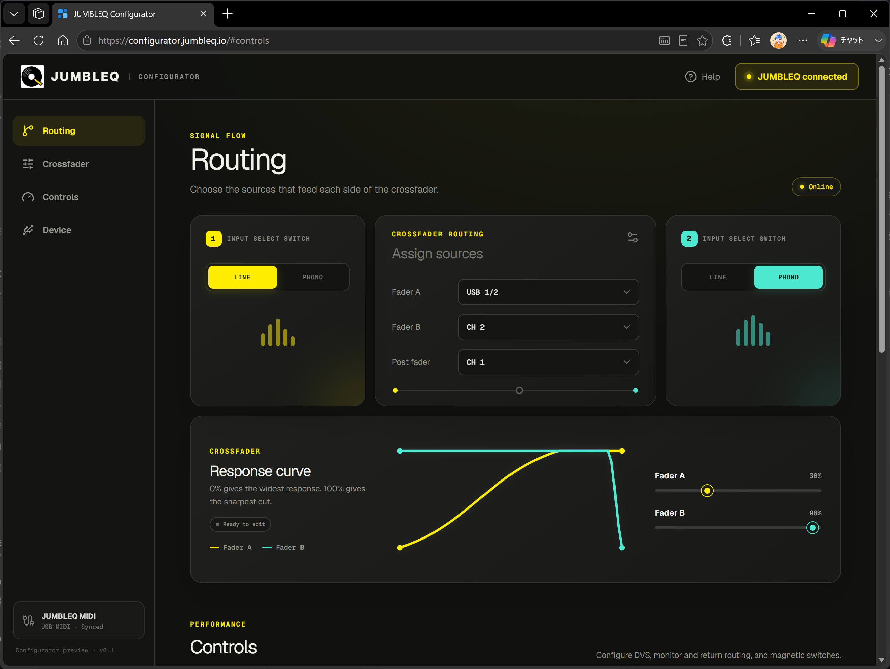
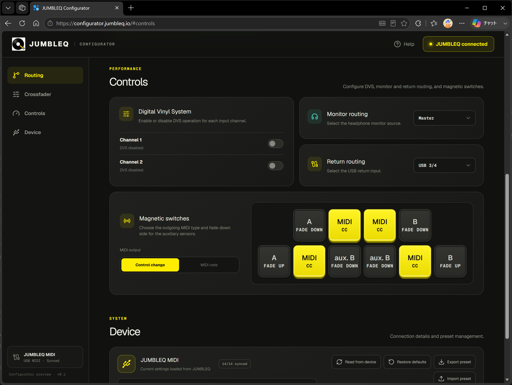

# JUMBLEQ Configurator

JUMBLEQ Configurator changes device settings by sending MIDI messages to JUMBLEQ.

## Web App (Recommended)

The browser-based [JUMBLEQ Configurator](https://configurator.jumbleq.io/) is the primary version and receives maintenance priority. It runs without installing a dedicated application; use a browser with Web MIDI support and connect JUMBLEQ to the computer over USB.

[Open JUMBLEQ Configurator](https://configurator.jumbleq.io/)

### Getting Started

1. Connect JUMBLEQ to the computer over USB and power it on.
2. Open the Web app and allow MIDI access when prompted by the browser.
3. Confirm that the connection status shows **JUMBLEQ connected** and that the device settings are synchronized.

The Web app provides controls for input and crossfader routing, XFader response curves, DVS, monitor and Return routing, magnetic-switch behavior, and device settings. It also supports reading the current settings from JUMBLEQ and importing or exporting presets.

## Alternative Max Versions

The Max Standalone and Max for Live versions remain in the repository for existing workflows, but they have a lower maintenance priority than the Web app. Their source files and packaged versions are available in the [`Max` directory](../../Max/).

### Max Standalone

The Max source patch can be opened with [Max 9](https://cycling74.com/products/max-9). Packaged archives for Windows and macOS are also retained in the `Max` directory.

### Max for Live

The [Max for Live device](../../Max/JUMBLEQ_Configurator.amxd) allows JUMBLEQ settings to be changed directly from Ableton Live.

For the MIDI messages used by the configurator, see the [MIDI reference](../reference/midi/README.md).
